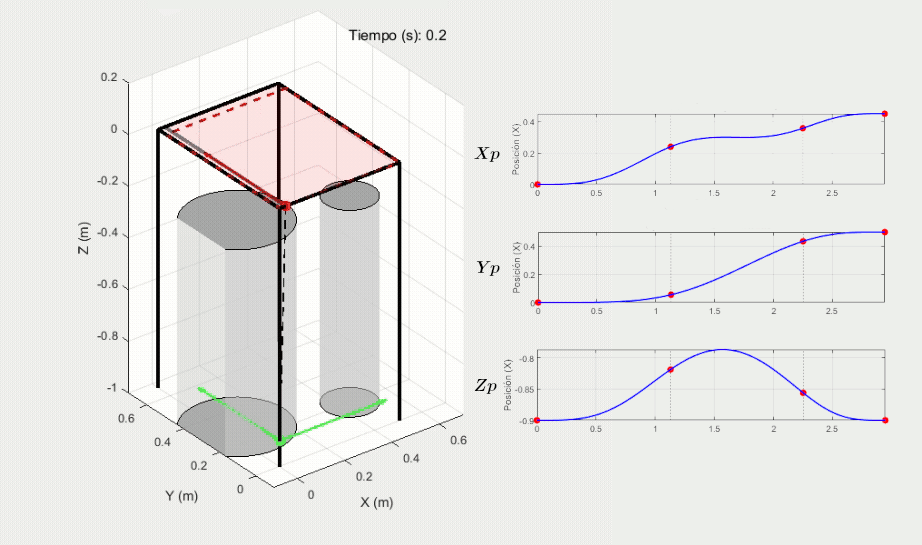

# Crane3DSim V1.0: 3D Overhead Crane Simulator

## Project Description

This repository hosts `Crane3DSim V1.0`, a MATLAB-based three-dimensional overhead crane simulator. Developed for dynamic analysis and control system design, `Crane3DSim` offers two main variants: one for continuous input signals and another for discrete control applications, facilitating research and development in the field of crane systems.

## Key Features

* **Full 3D Dynamic Simulation:** Models the complex dynamics of a three-dimensional overhead crane.
* **Two Operation Modes:**
    * **Continuous Simulator (`Crane3DSim_cont.m`):** Ideal for control inputs defined as continuous time functions, utilizing ODE solvers with event detection.
    * **Discrete Simulator (`Crane3DSim_disc.m`):** Designed to emulate real-world discrete control systems, allowing for the implementation of discrete-time controllers.
* **Customizable Controllers:** The discrete variant includes a designated "slot" for integrating custom Feedback (FB) or Feedforward (FF) controllers.
* **Comprehensive Visualization:** Generates detailed plots of state variables, forces, and a 3D animation of the crane's movement.
* **Identification Parameters:** Supports loading friction and PWM-to-force conversion parameters derived from experimental identification processes.

## Getting Started

### Requirements

* MATLAB (R2017a or higher recommended)
### Running a Simulation

1.  **Clone the Repository**
2.  **Open in MATLAB:** Open MATLAB and navigate to the root folder of the repository.
3.  **Generate Parameters (Optional, if `Example_identification.mat` does not exist):**
    Run the `ParametersMATgenerator.m` script to create the identification parameters file. The launchers by default will load `Example_identification.mat`.
4.  **Launch Example Simulations:**
    * **Continuous Simulation:** Open and run `Launcher_cont.m`. You can modify simulation parameters and PWM input signals directly within this file.
    * **Discrete Simulation:** Open and run `Launcher_disc.m`. Similar to the continuous version, you can configure parameters and PWM input matrices here. To implement your own discrete controller, you will need to modify the designated section within `Crane3DSim_disc.m`.

## Key Inputs and Outputs

### Continuous Simulator (`Crane3DSim_cont.m`)

* **Inputs:**
    * `frictions`: Structure containing static and dynamic friction coefficients.
    * `IMOT`, `IMOTx`, `IMOTy`: Motor inertias.
    * `ks`: Vector `[X_PWM_TO_F Y_PWM_TO_F Z_PWM_TO_F]` for PWM to force conversion.
    * `uPWM_x`, `uPWM_y`, `uPWM_z`: Function handles `@(t)` for continuous PWM inputs.
    * `masas`: Vector `[mc mw ms]` with payload, trolley, and rail masses.
    * `x0`: Initial state vector.
    * `tsimul`: Total simulation time.
    * `g`: Gravity constant.
    * `ph_limits`: Physical limits of the crane.

* **Outputs:**
    * `T_out`: Time vector of simulation results.
    * `DATA_OUT`: Matrix containing all state variables and derived quantities.
    * `ESTADO_OUT`: State of static friction and movement per axis.

### Discrete Simulator (`Crane3DSim_disc.m`)

* **Inputs:**
    * `fricciones`: Identical friction structure as in the continuous version.
    * `IMOT`, `IMOTx`, `IMOTy`: Motor inertias.
    * `ks`: Vector `[X_PWM_TO_F Y_PWM_TO_F Z_PWM_TO_F]`.
    * `uPWM_x_matriz`, `uPWM_y_matriz`, `uPWM_r_matriz`: Matrices defining discrete PWM inputs over time.
    * `masas`: Mass vector.
    * `x0`: Initial state vector.
    * `tsimul`: Total simulation time.
    * `T_sample`: Discrete sampling period.
    * `g`: Gravity constant.
    * `ph_limits`: Physical limits.
    * `refs`: Matrix of reference values for control.

* **Outputs:**
    * `T_out`: Time vector of simulation results.
    * `DATA_OUT`: Matrix containing all state variables and derived quantities.
    * `ESTADO_OUT`: State of static friction and movement per axis.

### Important Note on Friction Units:

The simulator is designed to receive friction parameters in units derived from the identification process (effectively in PWM-scaled units). If you wish to introduce friction parameters directly in International System (SI) units (Newtons for forces, N·s/m for dynamic friction coefficients), you must **remove the respective multiplications** by `X_PWM_TO_F`, `Y_PWM_TO_F`, and `Z_PWM_TO_F` in the `%% FRICTION` section of the `Crane3DSim_cont.m` and `Crane3DSim_disc.m` files.

## Additional Documentation

For a more detailed guide on setup, usage, and key functionalities of the simulator, please refer to the documentation:

* [Crane3DSim User Manual (PDF)](docs/Crane3DSim_Guide.pdf) *(Replace with the exact name and path of your PDF)*

## Contact

For questions or support regarding Crane3DSim, please contact J. Vicente-Martinez at j.vicente@unizar.es.

---
